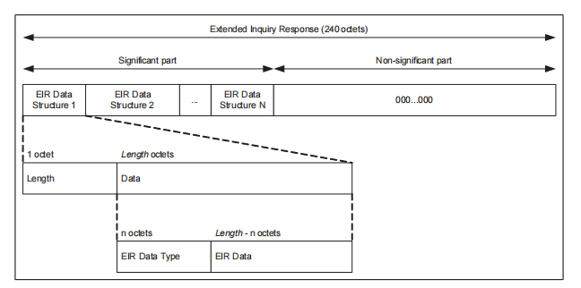
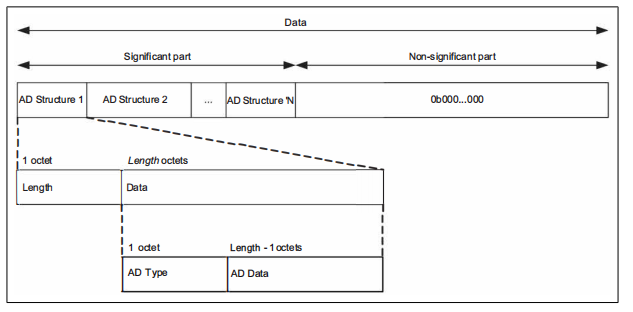

# 在Android中处理BLe的扫描数据

## 介绍

代码片段简单的描述正确的解析 `android` 的 `ble` 扫描数据。

在 `android` 中通过 `ble` 扫描会得到一个 `byte[]` ，这个 `byte[]` 中包含的是 `eir` 和
`advertising data`。

| type     | format               |
|----------|----------------------|
| eir data | Length - Type - Data |
| adv data | Length - Type - Data |





### 错误的示例

这种直接使用 index 来解析 `byte[]` 的方式，会出现解析到不同的结构体。`

```kotlin
fun decode(data: ByteArray) {
    val year = data[15]
    val month = data[16]
    val day = data[17]
    val hour = data[18]
    val minute = data[19]
    val second = data[20]
    //        ...
}
```

### 正确的示例

应该先通过 `type` 拿到 `struct`, 再解析 `struct` 里的 `data`。

```kotlin
fun decode(data: ByteArray) {
    val scanData = data.toScanData()
    val scanStruct = scanData.get(AdType.MANUFACTURER_SPECIFIC_DATA).find { it.intLength == 9 }
    if (null != scanStruct) {
        val rawData = scanStruct.rawData!!
        val year = rawData[index]
        val month = rawData[index + 1]
        val day = rawData[index + 2]
        val hour = rawData[index + 3]
        val minute = rawData[index + 4]
        val second = rawData[index + 5]
        //        ...
    } else {
        //TODO 扫描数据包里没有需要的结构体。
    }
}
```